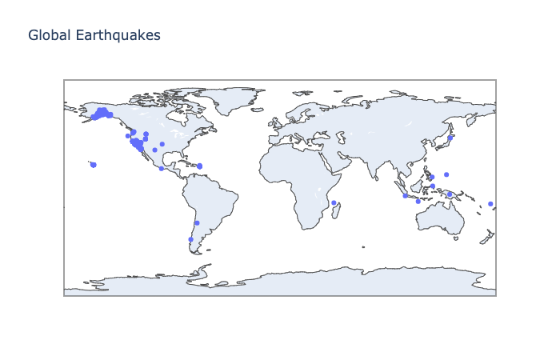

# EQ-Global-Data
Mapping earthquake data using Python and JavaScript Object Notation (JSON)

------------------------------------------------------------------------------------------------------------------------------

This interesting mini-project is from Eric Matthes project-based programming book titled "Python Crash Course". 

The sole purpose of this project was to hone my skills in data visualization with Plotly, and sharpen my skills using a specific tool in JavaScript (JSON). 

This project showcases the development of a GeoMapping tool. The tool (Plotly) shows all earthquakes that registered a magnitude of 1.0+ within the past 30 days (currently: February-March, 2020). 

The data used in this project was taken from the USGS: https://earthquake.usgs.gov/earthquakes/feed/

------------------------------------------------------------------------------------------------------------------------------

### Below is a preview of the completed GeoMap

------------------------------------------------------------------------------------------------------------------------------

### Part 1: Standard GeoMapping feature, plotting areas on a map that experience some form of earthquake 1.0+

------------------------------------------------------------------------------------------------------------------------------

### Part 2: Adding a sizing feature into the map that will represent the magnitude of the earthquake

------------------------------------------------------------------------------------------------------------------------------

### Part 3: Included a colorscale into the map. Dark blue represents a higher magnitude than a yellow colored marker.

------------------------------------------------------------------------------------------------------------------------------

### Below is a preview of the code

------------------------------------------------------------------------------------------------------------------------------
